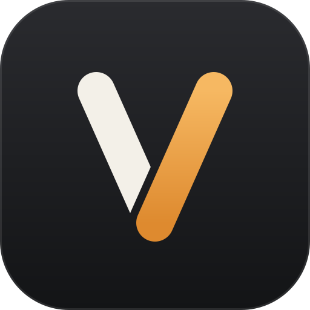

<p align="center"></p>

# ViewCode

ViewCode is a GUI for the coding agents you already pay for: **Claude Code, Codex,
Grok, OpenCode, Cursor, Antigravity and Command Code**. It runs them on your own
subscriptions, and lets them work as a team.

It is a fork of [T3 Code](https://github.com/pingdotgg/t3code) (MIT). That's where
the server, remote access, mobile app and provider integrations come from. On top of
that it adds the orchestration ideas from [Traycer](https://github.com/traycerai/traycer)
and a look inspired by Droppy Code and MonoCode.

## What ViewCode adds

- **Switch model or provider mid-chat.** Pick any model from any provider in the
  composer, even in the middle of a conversation.
  - **Same provider** (Opus → Sonnet): the provider's own session continues, so
    nothing is lost.
  - **Different provider or account** (Claude → Codex, or a second Claude login):
    ViewCode hands the context off. The new model gets a recap of the conversation
    plus the last few exchanges word for word. The full transcript is saved under
    `~/.viewcode/…/transcripts/`, and a "Context handed off" card marks the switch.
  - Models that will trigger a handoff are labelled **Handoff** in the picker.
- **Child agents.** An agent can start other agents. Each child is a full agent,
  with its own chat, transcript, model and composer.
  - Children appear nested under their parent in the sidebar. Open one to follow its
    work, prompt it, or switch its model.
  - You can also create one yourself with **New child agent** in the chat menu.
- **Agent-to-agent messaging.** Every agent gets a set of tools: `list_agents`,
  `list_models`, `spawn_agent`, `send_message`, `read_transcript` and
  `configure_agent`.
  - A message to an idle agent starts it working immediately. A message to a busy
    agent waits until its current turn ends.
  - When a reply is expected, the receiver's final answer is routed back to the
    sender automatically.
  - A hop limit (24 automatic hops) stops two agents from keeping each other busy
    forever.
  - Messages appear as **→ to / ← from** cards. An **Active agents · N running ·
    Stop all** bar sits above the composer.
- **In-chat sub-agents** (a model's own helpers, like Claude's Task tool) stay
  read-only inside the parent's timeline.
- **Sidebar grouped by project.** Always on the left: project folders, then threads,
  then the child-agent tree. Pin and archive only.
- **Dark glass look.** A violet-accent ViewCode theme is the default.

From T3 Code you also get:

- **Phone and remote access:** QR pairing, LAN, Tailscale, SSH and the mobile app.
- **Code history:** checkpoints for every turn, diffs, git worktrees.
- **Tools:** a built-in terminal and pull-request integrations.

## Install and run (from source)

There are no prebuilt downloads yet: you build ViewCode from this repository.

Requirements:

- Git, Node.js **24.13 or newer**, and pnpm 11 (`corepack enable` installs the
  right pnpm for you).
- At least one provider CLI installed and logged in:

| Provider     | Install                                 | Log in                |
| ------------ | --------------------------------------- | --------------------- |
| Claude Code  | https://claude.com/product/claude-code  | `claude auth login`   |
| Codex        | https://developers.openai.com/codex/cli | `codex login`         |
| Grok         | https://x.ai/cli                        | `grok login`          |
| OpenCode     | https://opencode.ai                     | `opencode auth login` |
| Cursor       | https://cursor.com/cli                  | `agent login`         |
| Command Code | `npm i -g command-code`                 | `cmd login`           |

The quick way: clone once, then run `./build.sh` whenever you want the latest.
It pulls, installs, builds the desktop app and opens it.

```bash
git clone https://github.com/CreatorGhost/ViewCode.git
cd ViewCode
./build.sh              # later runs: just ./build.sh again
./build.sh --no-pull    # build what you have checked out
./build.sh --web        # server + web UI instead of the desktop app
```

Or step by step:

```bash
corepack enable
pnpm install
```

Then pick one:

```bash
# The desktop app, built as it ships. It opens no network port.
pnpm build:desktop
pnpm --filter @t3tools/desktop start

# Or the server plus the web UI in your browser. Open the pairing URL it prints.
pnpm dev
```

`pnpm dev:desktop` also opens the desktop app, but in development mode, which
serves the window from a local dev server on a port.

To build an installer you can keep and double-click, run the command for your
operating system on that operating system. The file lands in `release/`.

```bash
pnpm dist:desktop:dmg     # macOS
pnpm dist:desktop:win     # Windows
pnpm dist:desktop:linux   # Linux (AppImage)
```

These builds are unsigned, so macOS and Windows warn the first time you open them.

A provider shows up automatically when its CLI is on your `PATH`. Turn providers on
or off in **Settings → Providers**. To add a second account for the same provider
(for example a work Claude login), create an extra provider instance with its own
home directory. A switch between accounts is handled as a handoff.

The server keeps its state in `~/.viewcode`. Telemetry is off by default.

## Using it from your phone

By default the server only listens on this machine. The desktop app goes
further: it opens no network port at all, and the window talks to the engine
over a local socket. To reach it from a phone:

1. In the desktop app, turn on **Settings → Connections → Network access**
   (the app restarts). From source, start the server on a reachable address
   (`--host 0.0.0.0`), or use Tailscale.
2. Mint a pairing link with `node apps/server/src/bin.ts pair` (add `--tailscale` for
   a tailnet URL), or from **Settings → Connections**.
3. Scan the QR code. Pairing tokens are single-use and expire after 5 minutes.
   Paired devices appear under Connections and can be revoked there.
4. Turn network access off again when you're done. The port closes.

The web UI adapts to phone screens: the sidebar becomes a drawer. The native mobile
app from T3 Code also connects.

## Docs

- Product plan and decisions: [docs/PLAN.md](./docs/PLAN.md)
- End goals and how each was verified: [docs/END_GOALS.md](./docs/END_GOALS.md);
  screenshots are in [docs/evidence/](./docs/evidence)
- User guides inherited from T3 Code: [docs/user/](./docs/user)
- Architecture: [docs/internals/overview.md](./docs/internals/overview.md)

## Credits

ViewCode is built on T3 Code by T3 Tools Inc. (MIT). See [LICENSE](./LICENSE). The
agent-orchestration model follows Traycer's published protocol. The visual design
takes cues from Droppy Code and MonoCode (both MIT).
